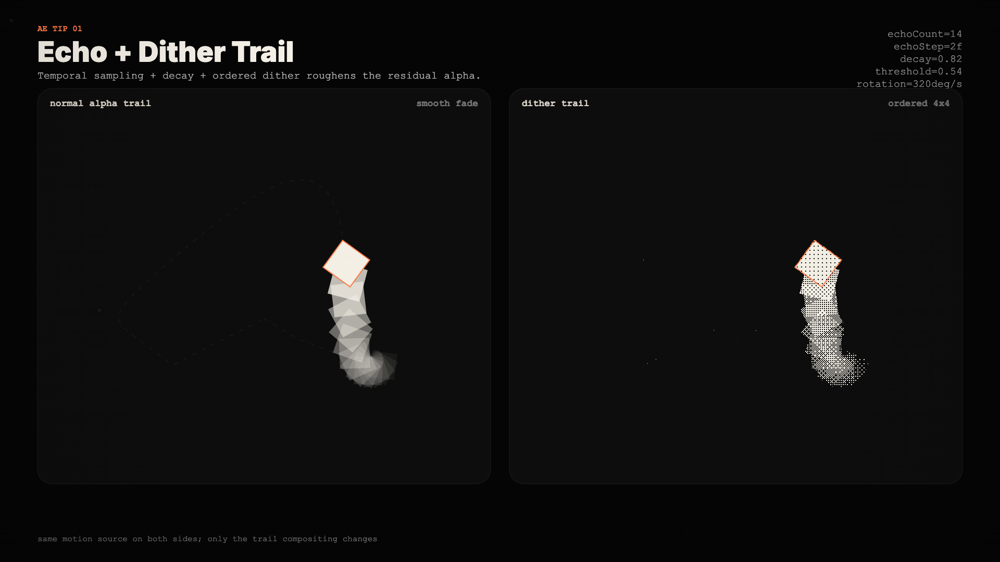
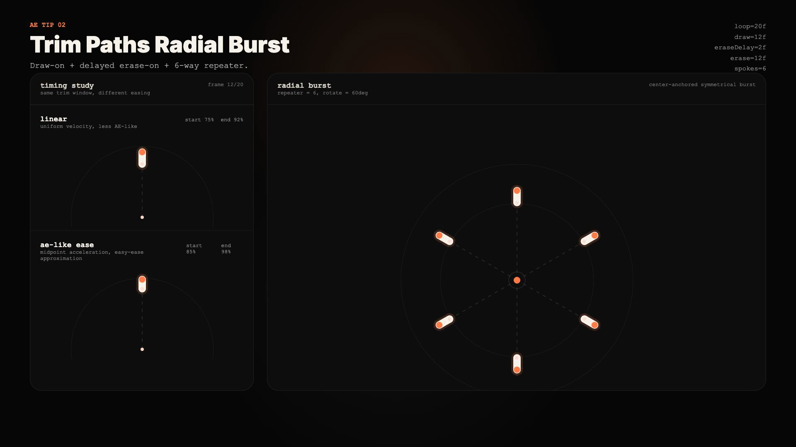

# Motion Recipes for Remotion

Short motion techniques translated into Remotion, inspired by AE-style tip workflows.

This repository is a public knowledge repo, not an asset dump. It focuses on how small motion ideas can be decomposed into reusable code primitives, parameterized timing, and minimal renderable recipes.

## What this repo is

- A compact Remotion app with two standalone motion recipes
- A public-facing subset extracted from a larger private R&D environment
- An educational exploration of technique translation, not template redistribution

## Gallery

| Recipe | Preview | Notes |
|---|---|---|
| Echo Dither Trail | [MP4](./media/echo-dither-trail/44-preview.mp4) | Temporal duplication + rough alpha texture |
| Echo Dither Trail |  | Smooth vs rough trail comparison |
| Trim Paths Radial Burst | [MP4](./media/trim-paths-radial-burst/45-preview.mp4) | Traveling segment + radial symmetry + eased mid-speed |
| Trim Paths Radial Burst |  | Single-spoke timing study + 6-way burst |

## Why these experiments exist

I use short motion studies to translate visual ideas from timeline-based motion workflows into reusable code. The goal is not to mimic a source video frame-by-frame, but to identify the motion primitive that matters and make it inspectable, configurable, and renderable.

## Quick Start

```bash
bun install
bun run dev
```

Render the included recipes:

```bash
bun run render:44
bun run render:45
```

## Recipes

| Recipe | Code | Doc |
|---|---|---|
| Echo Dither Trail | [`src/recipes/echo-dither-trail`](./src/recipes/echo-dither-trail) | [`docs/recipes/echo-dither-trail.md`](./docs/recipes/echo-dither-trail.md) |
| Trim Paths Radial Burst | [`src/recipes/trim-paths-radial-burst`](./src/recipes/trim-paths-radial-burst) | [`docs/recipes/trim-paths-radial-burst.md`](./docs/recipes/trim-paths-radial-burst.md) |

## Attribution / Inspiration

These studies are inspired by short motion-tip workflows shared by motion designers and editors. Each recipe doc includes an `Inspiration` section with source attribution and link when that information is available in the project notes.

This repository intentionally shares:

- original code written for the translated technique
- parameterized configs
- rendered previews from the recreated implementation

This repository intentionally does **not** share:

- extracted source video frames
- original project files
- proprietary assets, logos, fonts, or audio from source tutorials
- commercial templates for resale

## What is intentionally not included

- The broader private `remotion-motion-lab` environment
- Other experiments unrelated to these two recipes
- Original source media used by other creators
- Side-by-side source-vs-recreation comparison boards

## Personal Profile / GitHub CTA

If this repo is useful, start with the code and recipe docs. The point of this project is technical clarity first: what changed, what was extracted, and why the motion reads the way it does.

- GitHub profile: [chibataku0815](https://github.com/chibataku0815)
- X post drafts for this repo: [`docs/x-posts`](./docs/x-posts)
